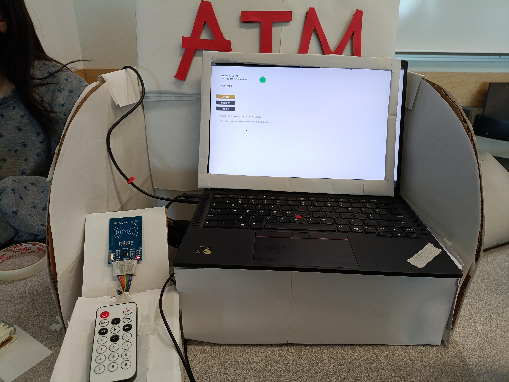

# Data-Transfer-NFC-Prototype

## About 
This is the Data Transfer NFC Project made for IAT 267 Spring 2025. This project is made by: 
- Cohen Jasper ter Heide 
- Kayne Hoy 
- Miku Miyauchi 
- Richa Daiya 
- Viet Anh (Zack) Hoang 
This project aims to replicate an ATM Machine that works closely to real life ATM Machines but with much more simplification and primitive data storage. 
This project has allowed us to learn more about:  
- RFID data write/storage
- Serial communication
- Intuitive UI desingn that matches with the hardware system 
- Final product assembly (we just used cardboards lol)

## Features 
### Software
- Create account with user's name and a random PIN with initial 100 units of spending 
- Transfer between accounts 
- View user's profile 
### Hardware 
- Readable/Writable RFID sensor and tag cards 
- Ultrasonic sensor that detects range for program activation 
- Input remote control 
- Motor sensor for haptic feedback 
- Sound sensor for success/error report 

[Project Demo](https://youtu.be/1OEkHSaVRyA)

